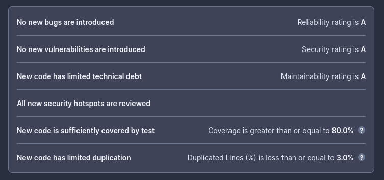

# <center>TP DevOps - S8 - DOHOU Medhy - Promo 2025</center>

## Day 1 - Docker
## Database

### Why should we run the container with a flag -e to give the environment variables?

We should use the `-e` flag to ensure that our container images are as generic as possible, instead of hardcoding them directly into the image. It is possible to override environment variables using this flag, but say the user might not read the doc, they might encounter behaviour they're unfamiliar with. It also ensure that the credentials are not exposed through the VCS.

### Why do we need a volume to be attached to our postgres container?

A volume is a piece of disk space that is shared between a container and it's host. A container is a stateless machine by default, meaning that it does not persist data in its filesystem after a reboot. Providing a volume (or a database connection, an S3 connect... by externalizing the stateful part of the app), we mount in our containers' filesystem a persistence point for it to store data indefinitely.

### Document your database container essentials: commands and Dockerfile.

There's 2 scripts at the root of this repository : 

- `prepare_data_folder.sh` : This ones create a temporary directory to store the data of the postgres database
- `start_databases.sh` : This script checks the existence of the docker command : if it doesn't exists, the user is prompted to install docker on the machine. Otherwise, it builds the postgres image (with our custom SQL initialization scripts embedded, from `dockerfiles/configs/db`). Then it checks the existence of our docker private network, if it doesn't exists, it creates it. Once that's out of the way, the scripts checks for the exitence of the containers for postgres and adminer, if they exist, we destroy them to start fresh. Then both containers are created. There's a bunch of environment variables that can be overloaded.

#### Overloading the `start_databases.sh` defaults
- `POSTGRES_DB` : The name of the initial database created when the postgres container starts. Defaults to `db`.
- `POSTGRES_USER` : The name of the initial user. Defaults to `usr`
- `POSTGRES_PASSWORD` : The password of the initial user. Defaults to `pwd`.


## Backend API

### Why do we need a multistage build? And explain each step of this dockerfile.

We need multistage build to ship a minimal size image while also ensuring the build environment is the same for every environment we might want to deploy our images to. At the same time, by using two different stages (one for build, one for runtime), we can ensure that we only have the bare minimum needed to run our application. It could also be argued that it reduces the attack surface of the container by embedding less possible CVE sources.

Now for the explaination : 

```dockerfile

# We pull the maven base image from docker hub, from which we create a stage
# We also give it an alias of build so as to easily copy the produced files after this stage is done
FROM maven:3.9.6-sapmachine-21 AS build
# We create an environment variable in the container building context
ENV MYAPP_HOME /opt/app

# The workdir directive allows us to change the current working directory during image build, as well as set the working directory for the image entrypoint
WORKDIR ${MYAPP_HOME}
# We copy the content of the backend-api source folder to the current working directory (note: this is subobtimal)
COPY backend-api ${MYAPP_HOME} 

# Finally for this stage, we run this command, that allows maven to produce us an executable jar file. Note that we skip tests, as the testing phase isn't our responsibility
RUN mvn package -DskipTests

# We move on to the "run" stage, our container will ultimately run off of this base image
FROM eclipse-temurin:21-jre-alpine

# Same as the build stage
ENV MYAPP_HOME /opt/app
WORKDIR $MYAPP_HOME
# We copy the produced jar files from the build stage over to our run stage
COPY --from=build $MYAPP_HOME/target/*.jar $MYAPP_HOME/api.jar

# Finally, we use this java command that executes our produced jar as the entrypoint of our container
ENTRYPOINT java -jar api.jar

```

## HTTP Server (Apache httpd)

### Why do we need a reverse proxy?

We use a reverse proxy as an entrypoint to our infrastructure from the outside world. By using a reverse proxy, we can expose selected server, ports & services as we please. Not only does this increase security, but we can also have different features like route binding (binding an app to <url>/app-1 and another one to <url>/app-2, for example), we can also do load-balancing, ip filtering, add or modify http-headers. These are only a couple possibilities with a reverse proxy. 

In our case, much like a company, we are trying to expose services available on our docker private network to our public net (in our case, localhost).

## Docker compose

### Why is docker-compose so important?

Because it allows us to describe the environment in a comprehensive way, rather than having a script for each service we'd like to up/down/restart. It is a descriptive way to describe containers, networks, and objects present in the infrastructure.

### Document docker-compose most important commands.

- `docker compose up [service name in compose file]`, is used to deploy containers of your current working directorys' `docker-compose.yml` file on the local machine. It spawns the container, adds the networks and objects, such as volumes, necessary for everything to work together. This command eventually takes a service name to bring up.
- `docker compose down [service name in compose file]` is the opposite of the previous command, as it is used to destroy services containers currently running on the host. 
- `docker compose logs` can be used to view the recent logs of the services.

### Document your `docker-compose.yml`


```yml
version: '3.7'

services:
    # Our backend service descriptor
    backend:
        # We tell our compose file where to find our Dockerfile for this service
        build:
          dockerfile: Dockerfile.api
        networks:
          - app-network
        # To start, our backend needs the database service to exist
        depends_on:
          - database

    database:
        build:
          dockerfile: Dockerfile.db
        networks:
          - app-network
        # We attach our postgres directory as a volume of this services' container (for data persistence)
        volumes:
          - /tmp/tp-devops/medhy-dohou/postgres:/var/lib/data/postgres
        # We describe here our environment variable in this services' container
        environment:
          POSTGRES_USER: usr
          POSTGRES_DB: db
          POSTGRES_PASSWORD: pwd

    httpd:
        build:
          dockerfile: Dockerfile.http
        # We describe here, the ports exposed on our host from this container
        ports:
          - 80:80
        networks:
          - app-network
        depends_on:
          - backend

# We declare our app-network here
networks:
    app-network:
```

## Day 2 - Github Actions

## Setup GitHub Actions

### Unit tests? Component tests?

Unit tests are meant to test small parts of a class logic, such as a function, or a constructor.

Component tests (or integrations test), are for testing the logic of the application itself, so it can test more functions and multiple classes and how they interact with each others.

### What are testcontainers ?

Testcontainers is a library that leverages the docker software to spawn databases/external services dynamically, for testing purposes. This way, we can test our code without mocking these external services, allowing us to test integration in an environment closer to the production. It also means less time developing and maintaining mocks.

### Document your GitHub Actions configurations
Our test workflow (`test.yml`): 
```yml
name: Tests
on:
  push:
  pull_request:

jobs:
  test-backend:
    # We request an environment based on ubuntu 22.04, but this setting also supports
    # taking in docker images.
    runs-on: ubuntu-22.04
    steps:
      # We get our repository code via this action
      - uses: actions/checkout@v2.5.0

      # We use the setup java action to get a temurin JDK 21 to test our backend code
      - name: Set up JDK 21
        uses: actions/setup-java@v4
        with:
          distribution: "temurin"
          java-version: "21"
      # We finally launch our maven clean (to ensure we clean our environment to reduce noise)
      # And we use the verify command to test our app
      - name: Build and test with Maven
        working-directory: backend-api
        run: mvn clean verify
      # Once everything is setup, we simply send our code to sonar using
      # The built-in sonarqube sonarqube plugin of maven. We pass our project key, org,
      # and token (in a secret), through.
      - name: Send to sonarcloud for static analysis
        working-directory: backend-api
        run: mvn -B verify sonar:sonar -Dsonar.projectKey=${{ vars.SONAR_PROJECT_KEY }} -Dsonar.organization=${{ vars.SONAR_ORGANIZATION }} -Dsonar.host.url=https://sonarcloud.io -Dsonar.login=${{ secrets.SONAR_TOKEN }}
```

Our main pipeline, that builds and push our images to Dockerhub (`main.yml`):

```yml
name: Main pipeline

# We only start building our docker containers if the tests pipeline was ran
on:
  workflow_run:
    workflows: [ "Tests" ]
    branches:
    types:
      - completed


jobs:
  build-and-push-docker-image-nightly:
    # We only run this job if the previous pipeline was sucessful
    if: ${{ github.event.workflow_run.conclusion == 'success' }}
    runs-on: ubuntu-22.04
    # Our docker tag is our branch name, this was supposed to be used for the 
    # "push on tag" pipeline that I was trying to make
    env:
      DOCKERHUB_TAG: ${{ github.ref_name }}
    # steps to perform in job
    steps:
      - name: Checkout code
        uses: actions/checkout@v2.5.0
      # This actions allows us to authenticate to DockerHub, so that we may
      # Push our images on our repository. We obviously use secrets here.
      - name: Login to Docker Hub
        uses: docker/login-action@v3
        with:
          username: ${{ secrets.DOCKERHUB_USERNAME }}
          password: ${{ secrets.DOCKERHUB_TOKEN }}

      # The next 3 jobs are similar, we use the build-push action to build then
      # push the image to our docker repository
      - name: Build image and push backend
        uses: docker/build-push-action@v3
        with:
          # relative path to the place where source code with Dockerfile is located
          file: ./Dockerfile.api
          push: ${{ github.ref == 'refs/heads/main' }}
          tags: ${{secrets.DOCKERHUB_USERNAME}}/api:${{ env.DOCKERHUB_TAG }}

      - name: Build image and push database
        uses: docker/build-push-action@v3
        with:
          # relative path to the place where source code with Dockerfile is located
          file: ./Dockerfile.db
          push: ${{ github.ref == 'refs/heads/main' }}
          tags: ${{secrets.DOCKERHUB_USERNAME}}/database:${{ env.DOCKERHUB_TAG }}
          

      - name: Build image and push httpd
        uses: docker/build-push-action@v3
        with:
          # relative path to the place where source code with Dockerfile is located
          file: ./Dockerfile.http
          push: ${{ github.ref == 'refs/heads/main' }}
          tags: ${{secrets.DOCKERHUB_USERNAME}}/httpd:${{ env.DOCKERHUB_TAG }}

      - name: Build image and push front
        uses: docker/build-push-action@v3
        with:
          # relative path to the place where source code with Dockerfile is located
          # Here we use another build context, since our Dockerfile is located in a sub-directory
          context: ./front
          file: ./front/Dockerfile
          push: ${{ github.ref == 'refs/heads/main' }}
          tags: ${{secrets.DOCKERHUB_USERNAME}}/front:${{ env.DOCKERHUB_TAG }}
```


### Document your quality gate


This is Sonars' default Quality Gate, it means our code only passes the check and so does our pipeline, only if there's no new bugs, if all the security hotspots are reviewed (security hotspots are auto-detected pieces of code that sonar flags as potential security threats), if there's little technical debt introduced. The code must also have a coverage of 80%+ (which is... idealistic in an industrial context), and the code must also limit duplication (lines that are identic and could/should be refactored as a function call for example).

## Day 3 - Ansible

## Introduction

### Document your inventory and base commands

```yml
---
all:
  vars:
    # This is the user used by ansible to SSH into our servers
    ansible_user: centos
    # The path to our SSH key, used by ansible to connect to our user
    ansible_ssh_private_key_file: /home/medhy/.ssh/id_ansible_tp
    # This is the name of our containes
    api_container_name: backend
    database_container_name: database
    httpd_container_name: httpd
    frontend_container_name: frontend
    # These variables are our username, password, and database name for both
    # our database container and our api container
    # These variables could or rather should be vaulted...
    db_user: "usr"
    db_password: "pwd"
    db_database_name: "db"
    db_url: "{{ database_container_name }}"
    db_port: "5432"
  # These are our server ! They're grouped under tags, which means in the future
  # we could have other environments here. 
  children:
    prod:
      hosts: medhy.dohou.takima.cloud
```

Some of the base command we can do with this inventory :
- `ansible-lint playbook.yml` is a command that needs to be installed (`pip install ansible-lint`). It allows us to lint our playbook and role to check for any issues, and ensure our IaC doesn't contain any error, and respects some normalization rules.
- `ansible -m ping -i inventories/setup.yml` allows us to ensure that we can connect to our hosts using the defined credentials
- `ansible all -i inventories/setup.yml -m setup -a "filter=ansible_distribution*"` leverages the setup module to get info on our server, here we pass the filter to extract the ansible_distribtion..... values to get our distribution from the servers.

### Playbooks

### Document your playbook

```yml
---
- name: Install containers on all hosts
  # We want to run this playbook on all of our hosts
  hosts: all
  gather_facts: false
  # We want to run the roles described afterwards as a superuser
  become: true
  roles:
    # Installs docker and its prerequisites
    - docker
    # Creates the docker network for our app containers
    - create_app_network
    # Spawns the httpd proxy container
    - httpd
    # Spawns our database container
    - db
    # Spawns our backend container
    - api
    # Spawns our frontend container
    - front
  vars:
    # this is the docker network name for our applications network
    app_docker_network_name: "app-network"
```

Here's the role for our docker installation:

```yml
---

- name: Add repo docker
  # We use the builtin yum repository module to install the official docker 
  # RHEL repo
  ansible.builtin.yum_repository:
    name: docker
    description: Docker repository for Yum
    # This is where our packages lives
    baseurl: https://download.docker.com/linux/centos/$releasever/$basearch/stable
    # Since we want to avoid MITM/Poisoned DNS attacks, we use GPG keys to ensure the package are correct
    gpgkey: https://download.docker.com/linux/centos/gpg
    gpgcheck: true
    # We enable this repository so we can download docker from there
    enabled: true

# We install a bunch of prerequisites
- name: Install device-mapper-persistent-data
  ansible.builtin.yum:
    name: device-mapper-persistent-data
    state: latest

- name: Install lvm2
  ansible.builtin.yum:
    name: lvm2
    state: latest

# We leverage the yum module to install the docker compute engine and python 3 (only python 2 is bundled with RHEL 7.2)
- name: Install Docker
  ansible.builtin.yum:
    name: docker-ce
    state: present
  # We want to ensure the docker service is running after the end of the playbook
  # So we use a handler for that
  notify:
    - Ensure Docker is running

- name: Install python3
  ansible.builtin.yum:
    name: python3
    state: present

# We use the pip module to install the docker package (we also specify the python3 binary path as a var
# since we want to install the module for python3)
- name: Install docker with Python 3
  ansible.builtin.pip:
    name: docker
    executable: pip3
  vars:
    ansible_python_interpreter: /usr/bin/python3
```

Here are our handlers for this role :

```yml
---
- name: Ensure Docker is running
  # We simply use the service module to check that the docker service is running
  # if not, we start it
  ansible.builtin.service:
    name: docker
    state: started
  tags: docker
```

To create our docker network we use these tasks:

```yml
---
- name: Create network if it doesn't exist
  # We use the docker_network module to ensure the existence of this network
  community.docker.docker_network:
    name: "{{ app_docker_network_name }}"
```

### Document your docker_container tasks configuration.

For the containers, I will only describe the httpd container. As all the other ones are copy-pasting (except for the ports, which are only exposed for the httpd container :) )

```yml
---
- name: Pull and start httpd container
  community.docker.docker_container:
    # We force the recreation and the pull of the image for the container
    # Otherwise, this docker_container role only checks the name of the container
    # and the image NAME for existence, meaning that if we update our main tag
    # for the docker image... it won't pull it
    recreate: true
    pull: true
    name: "{{ httpd_container_name }}"
    image: "medhydohoucpe/httpd:main"
    # We expose both the port of our frontend and the port of our api
    published_ports:
      - "80:80"
      - "8080:8080"
    networks:
      - name: "{{ app_docker_network_name }}"

# This task gather informations on the container
- name: Check httpd container status
  community.docker.docker_container_info:
    name: "{{ httpd_container_name }}"
  register: result

# This task takes the result of the previous tasks, and fails if the container isn't running.
# It logs the error and the error code if the container didn't run
- name: Fail if httpd container isn't running
  ansible.builtin.fail:
    msg: "The api container failed to start : exit code {{ result.container.State.ExitCode }} (error : {{ result.container.State.Error }})"
  when: not result.container.State.Running
```


### Continuous deployment

Before deploying, we run a Ansible Check pipeline that lints our playbook to ensure that there's no issue with it prior to deployment. If it fails, nothing is deployed to our environment, ensuring we do not run pipeline for nothing.

Here's the ansible linting pipeline:

```yml
name: ansible-check

# We only launch this job if we're on main and the Main pipeline has succedded, if we're on a pull request (to ensure no
# regressions are introduced), or if it's manually triggered 
on:
  workflow_run:
    workflows: ["Main pipeline"]
    branches:
      - main
  pull_request:
  workflow_dispatch:

jobs:
  ansible-lint:
    runs-on: ubuntu-22.04
    # We set the working directory of this pipeline to our ansible dir
    defaults:
      run:
        working-directory: ./ansible
    # We need to lint the vaulted files too
    env:
      VAULT_PASS: ${{ secrets.VAULT_PASSWORD }}
    steps:
      - name: Fail if main pipeline failed
        if: ${{ github.event_name == 'pull_request' && github.event_name != 'workflow_dispatch' && github.event.workflowgithub.event.workflow_run.conclusion != 'success' }}
        run: exit 1
      - name: Checkout code
        uses: actions/checkout@v2.5.0
      # We install ansible-lint
      - name: Install ansible-lint with pip
        run: |
          sudo apt update
          sudo apt install pip git
          pip install ansible-core ansible-lint
      # We copy our VAULT_PASSWORD so as to allow ansible-lint to decrypt and lint them.
      # We also install our playbooks' dependencies
      - name: Run ansible-lint on our playbook
        run: |
          echo ${VAULT_PASS} > .vault_password
          ansible-galaxy collection install -r requirements.yml
          ANSIBLE_VAULT_PASSWORD_FILE=.vault_password ansible-lint -v -s --project-dir .
```

Once this step is done, our deployment pipeline is triggered :

```yml
name: Deploy to production

# We only deploy to production if... we're on the main branch, and the ansible-check has passed
# It is not necessary for now to add a dependency to the test pipeline because it won't 
# publish our images if it doesn't pass
on:
  workflow_run:
    workflows: ["ansible-check"]
    branches: [main]
    types: 
      - completed
  workflow_dispatch:

jobs:
    deploy-to-prod:
        runs-on: ubuntu-22.04
        steps:
            - name: Checkout code
              uses: actions/checkout@v2.5.0
            - name: Deploy to prod
              # We only deploy to prod if the ansible-check was successful
              if: ${{ github.event.workflow_run.conclusion == 'success' }}
              # We use the ansible playbook action with our private key as well as our vault password.
              uses: dawidd6/action-ansible-playbook@v2
              with:
                directory: ./ansible
                playbook: playbook.yml
                key: ${{ secrets.ANSIBLE_SSH_PRIVATE_KEY }}
                vault_password: ${{ secrets.VAULT_PASSWORD }}
                # We give the fingerprint of our servers, to avoid DNS Redirection attacks
                known_hosts: |
                  medhy.dohou.takima.cloud ssh-ed25519 AAAAC3NzaC1lZDI1NTE5AAAAIN2lupj45sVom4e+f+1ifTxJTfW2TsKqyClld2s4kUvW
                options: |
                  --inventory ./inventories/setup.yml
                requirements: ./requirements.yml
``` 